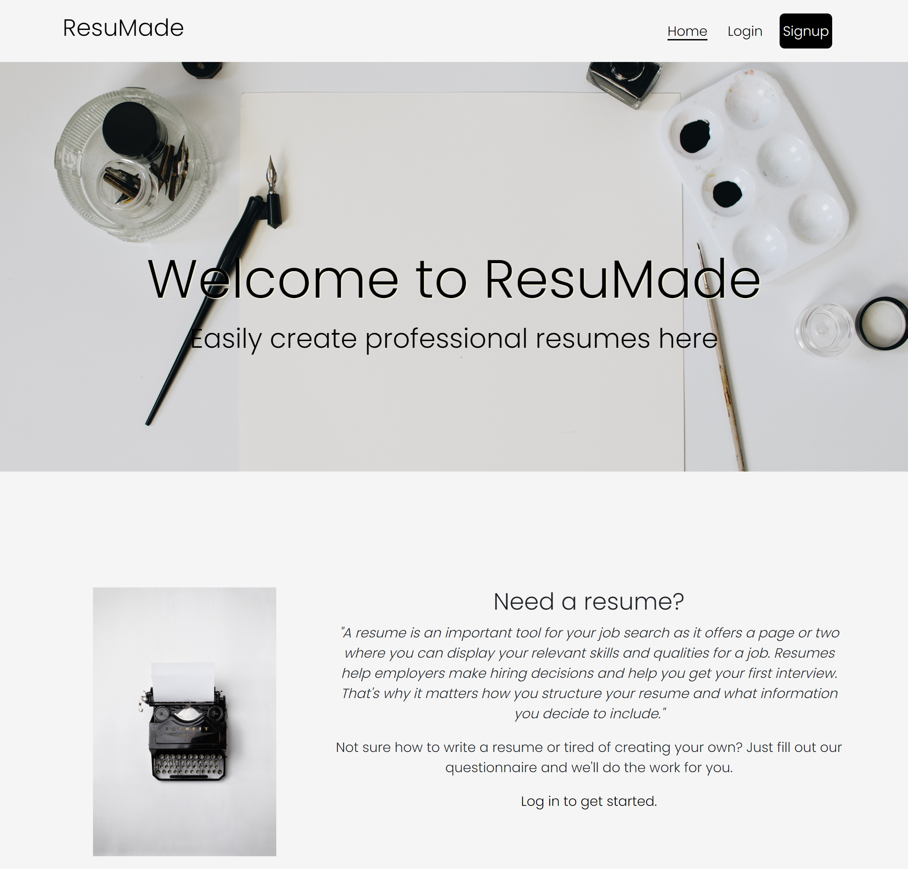

## ResuMade
Not sure how to write a resume or tired of creating your own? Just fill out our questionnaire and we'll do the work for you.

## License
  
[](https://www.gnu.org/licenses/gpl-3.0)

## Table of Contents

- [License](#license)
- [Description](#description)
- [Technologies](#technologies)
- [User Story](#user-story)
- [Acceptance Criteria](#acceptance-criteria)
- [Deployed Application](#deployed-application)
- [Future Improvements](#future-improvements)
- [Installation](#installation)
- [Usage](#usage)
- [Contributing](#contributing)
- [Tests](#tests)
- [Credits](#credits)
- [Questions](#questions)
- [License Information](#license-information)

## Description

Updated with the newest industry standards, our resume template asks only the important questions to let you quickly create a beautifully formatted resume. With the touch of a button, your resume will be downloaded and ready to send to your next dream job.

If the downloaded resume is misplaced, we've got that handled as well. Returning users can log in to view, edit, and download past saved resumes.

We offer a simple payment plan of $5.00 USD for each resume created. Payments are securely made through Stripe, a payment platform. After each purchase, your resume is available for unlimited downloads.

>*"A resume is an important tool for your job search as it offers a page or two where you can display your relevant skills and qualities for a job. Resumes help employers make hiring decisions and help you get your first interview. That's why it matters how you structure your resume and what information you decide to include."* - Indeed.com

__Disclaimer:__ Our template is specifically made for those seeking employment or advancement in the coding/web development industry. Certain questions within this form would not be applicable to other industries. This website focuses on the resume formatting and content only, and does not guarantee job placement or interview scheduling with any company. We hope this helps you!


### Motivation

The job search is daunting; we get it. Especially when changing fields. Created by five people who are empathic to this situation, this app aids all those who may have an uncertain but exciting future to unlock.

### What problem does it solve?

Our app caters specifically to those transitioning from another field and are new to the web development field. Our resume template also applies to those advancing or furthering their career in this field. We focus on transferrable skills with an emphasis on projects in the center of the resume.

At this time, the resume template is not applicable to industries outside of web development. We welcome your feedback, suggestions, or contributions, though!

### What did you learn?

* Some npm packages and versions of those packages created some tangles at times.
* We got more practice with debugging, especially with the Heroku deployment.
* Each of us became more knowledgable about the tool or technology he or she was tasked.

### What makes your project stand out?

Our simple, clean design partners with an effective, ready-to-use resume template to result in a powerful and practical website. We hope our users find their industry transition made a little easier if they choose to use our services.

## Technologies

##### Client-Side Dependencies
- Ant Design
- Apollo Client
- Bootstrap
- docx
- file-saver
- React
- Stripe

##### Server-Side Dependencies
- Apollo Server Express
- bcrypt
- dotenv
- Express
- GraphQL
- jsonwebtoken
- MongoDB & Mongoose
- Node.js
- Stripe

##### Dev Dependencies
- Concurrently
- Nodemon
- Faker.js

##### Repository and Deployment
- Github repository
- Heroku deployment

(Reference 3 package.jsons to see a full list and versions)

## User Story

As a job seeker in the web development field, <br>
I want a stress-free resume-creation experience <br>
So that I can focus more attention on other areas of the job search

## Acceptance Criteria

GIVEN a resume-building app <br>
WHEN a user views the homepage, <br>
THEN they are given the options to login or signup. <br>
WHEN the user signs up,  <br>
THEN they are led to a dashboard with the option to create a new resume. <br>
WHEN the user logs in, <br>
THEN they are led to a dashboard with a display of their past saved resumes along with the option to create a new resume. <br>
WHEN the user clicks the "New Resume" button, <br>
THEN the user is led to a 7-part form with the following sections: Personal Info, Summary, Technical Skills, Projects, Experience, Education, and Preview. <br>
WHEN the user completes the form and clicks "Save & Preview," <br>
THEN the Preview is dynamically rendered with all of the user's inputted information. <br>
WHEN the user clicks "Download," <br>
THEN the user is led to the Stripe payment platform. <br>
WHEN the user completes the $5 payment for their resume, <br>
THEN the download begins automatically and the user is redirected to their dashboard. <br>
WHEN the user views their dashboard after creating a new resume, <br>
THEN the user sees their newest resume added to the list of past saved resumes. <br>
WHEN the user clicks "Edit" on a past saved resume, <br>
THEN the user may access that saved resume to edit. <br>
WHEN the user clicks "Delete" on a past saved resume, <br>
THEN that resume is deleted. <br>
WHEN the user clicks "Download" on a past saved resume, <br>
THEN that resume is downloaded once again. <br>
WHEN the user logs out, <br>
THEN their logout is successful and they are redirected to the homepage.

## Deployed Application

Heroku: [https://resumade.herokuapp.com/]

Github Repository: [https://github.com/PeytonCast/ResuMade]

## Future Improvements

* Add the functionality for a user to create a cover letter as well
* Increased security for form validations
* Turn the app into a PWA
* Refactor for neatness/readability
* More error handling throughout

## Installation

```
clone github repo
npm install
npm run build
npm run develop
Go to http://localhost:3001
```
OR follow the above heroku deployed application link

## Usage

### Screenshots

Homepage

User does this...
and this...

and also this...


## Contributing

Thanks for contributing! Please follow the license guidelines found in the License Information section.

Instructions to contribute:

1] Follow installation instructions above. <br>
2] Create a branch for your feature. <br>
3] The main branch is protected. Contact one of us to review and potentially merge your contribution when you have completed your feature.

## Tests

No tests are applicable to this project at this time.

## Credits

Collaborators:

 [Arthur Ong](https://github.com/odthientho),
 [Kathy Kang](https://github.com/KatSKang),
 [Madeleine Harris](https://github.com/miss-mad),
 [Melissa Stan](https://github.com/mstan19),
 [Peyton Castillo](https://github.com/PeytonCast)

## Questions

Any questions? We'd love to hear from you!
Contact any of us through our above linked githubs.

## License Information

Click on the license badge for more information about our license [](https://www.gnu.org/licenses/gpl-3.0)

---
